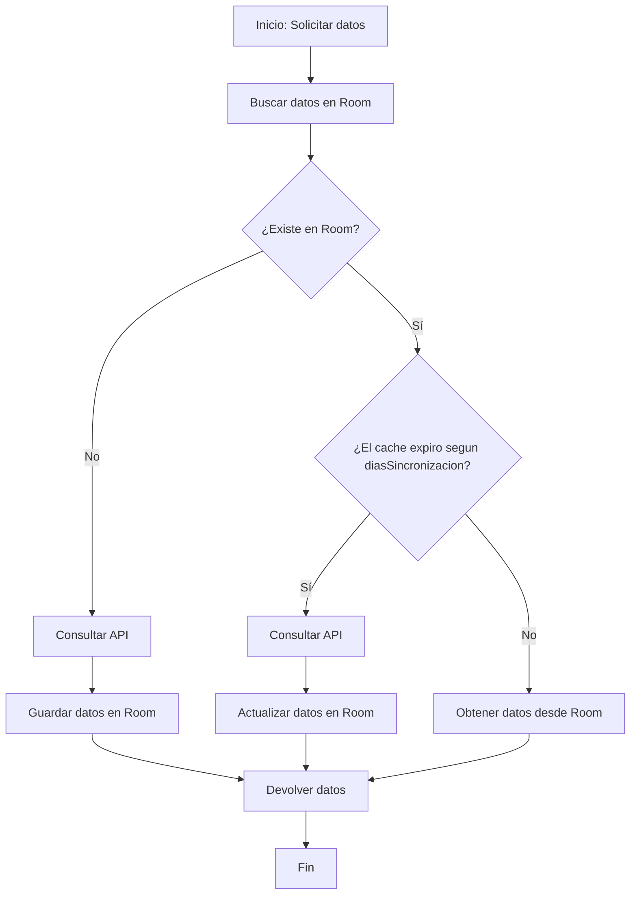

# PokeAyuda

Aplicación Android desarrollada con **Jetpack Compose** bajo una arquitectura **Clean Architecture + MVVM** y un enfoque **Offline-First**, permitiendo consultar información de Pokémon, almacenarla localmente y sincronizarla automáticamente cuando sea necesario.

## Arquitectura

El proyecto está organizado en tres capas principales para mantener una adecuada separación de responsabilidades.

```text
├── data
│   ├── local
│   │   ├── dao
│   │   ├── db
│   │   └── entity
│   ├── mapper
│   ├── remote
│   └── repository
├── di
├── domain
│   ├── model
│   └── usecase
└── ui
    ├── components
    ├── navigation
    ├── screens
    │   ├── battle
    │   ├── compare
    │   ├── detail
    │   ├── pokemon
    │   └── settings
    └── theme
```

### Data
Contiene el acceso a los datos de la aplicación. Incluye la base de datos local con Room (`local`), el consumo de la API (`remote`), los repositorios encargados del enfoque Offline-First (`repository`) y los mapeadores entre modelos (`mapper`).

### Domain
Contiene la lógica de negocio de la aplicación. Aquí se encuentran los modelos de dominio (`model`) y los casos de uso (`usecase`) que encapsulan las operaciones principales del sistema.

### UI
Contiene toda la interfaz desarrollada con Jetpack Compose. Está organizada por funcionalidades (features), incluyendo pantallas, navegación, componentes reutilizables y el tema de la aplicación.

### DI
Contiene la configuración de Hilt para la inyección de dependencias, facilitando la creación y administración de los distintos componentes de la aplicación.


## Flujo Offline-First

La aplicación implementa una estrategia de cache local utilizando Room como fuente principal de datos.



Este flujo permite que la aplicación consulte primero la información almacenada localmente. Si los datos no existen, se obtienen desde la API y posteriormente se almacenan en Room. Cuando los datos ya están disponibles localmente, se verifica si el tiempo de sincronización ha expirado; en ese caso se actualiza la información desde la API. Si el cache aún es válido, los datos se obtienen directamente desde Room, evitando llamadas innecesarias a la red y garantizando el funcionamiento Offline-First.